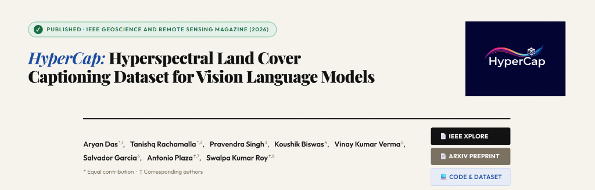
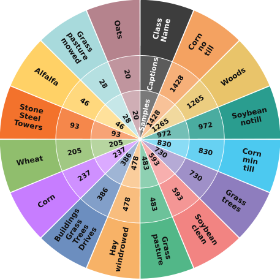
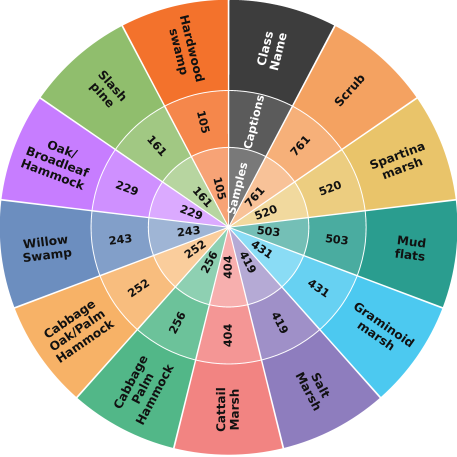
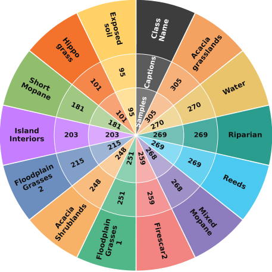
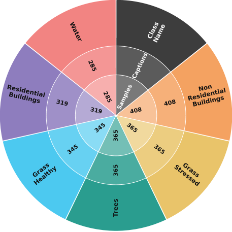

# HyperCap: Hyperspectral Land Cover Captioning Dataset for Vision Language Models

<p align="center">
  
</p>

<div align="center">
  <h3>IEEE Geoscience and Remote Sensing Magazine (GRSM) 2026</h3>
  <p><strong><a href="https://www.linkedin.com/in/aryan--das/">Aryan Das</a>*, <a href="https://www.linkedin.com/in/tanishqrachamalla/">Tanishq Rachamalla</a>*, <a href="https://www.iitr.ac.in/~CSE/Pravendra_Singh">Pravendra Singh</a>, <a href="https://www.linkedin.com/in/koushik-biswas-ml/">Koushik Biswas</a>, <a href="https://scholar.google.com/citations?user=7x6GZ1EAAAAJ&hl=en">Vinay Kumar Verma</a>, <a href="https://scholar.google.com/citations?user=vIC06a0AAAAJ&hl=en">Salvador Garcia</a>, <a href="https://scholar.google.com/citations?user=F1UAj8oAAAAJ&hl=en">Antonio Plaza</a>†, <a href="https://swalpa.github.io/">Swalpa Kumar Roy</a>†</strong></p>
  <p><em>* Equal contribution | † Corresponding authors</em></p>
</div>

<div align="center">
  <a href="https://ieeexplore.ieee.org/document/11550167/">
    
  </a>
  <a href="https://arxiv.org/abs/2505.12217">
    
  </a>
  <a href="http://hypercap.netlify.app">
    
  </a>
  <a href="https://github.com/arya-domain/HyperCap">
    
  </a>
</div>

<div align="center">
  
  
  
  
</div>

---

Official repository for **"HyperCap: A Hyperspectral Land-Cover Captioning Dataset for Vision–Language Models"**, published in **IEEE Geoscience and Remote Sensing Magazine (GRSM), 2026**.

---

## 📖 Abstract

We introduce **HyperCap**, the first large-scale hyperspectral captioning dataset designed to enhance model performance and effectiveness in remote sensing applications. Unlike traditional hyperspectral imaging (HSI) benchmarks, HyperCap integrates spectral data with pixel-wise textual annotations, enabling deeper semantic understanding. This dataset enhances model performance in tasks like classification and feature extraction, providing a valuable resource for advanced remote sensing applications. HyperCap is constructed from four benchmark datasets — Botswana, Houston 2013, Indian Pines, and Kennedy Space Center — and annotated through a hybrid approach combining automated and manual methods to ensure accuracy and consistency. Empirical evaluations using state-of-the-art encoders and diverse fusion techniques demonstrate significant improvements in classification performance. These results underscore the potential of vision-language learning in HSI and position HyperCap as a foundational dataset for future research in the field.

---

## 📊 Dataset Statistics & Class Distributions

HyperCap provides **21,237 pixel-wise, expert-refined captions** spanning **50 land cover classes** across four standard hyperspectral imaging benchmarks.

<p align="center">
  <table align="center" border="0">
    <tr>
      <td align="center"><strong>Indian Pines (10,248 captions)</strong></td>
      <td align="center"><strong>Kennedy Space Center (5,211 captions)</strong></td>
    </tr>
    <tr>
      <td></td>
      <td></td>
    </tr>
    <tr>
      <td align="center"><strong>Botswana (3,248 captions)</strong></td>
      <td align="center"><strong>Houston 2013 (2,530 captions)</strong></td>
    </tr>
    <tr>
      <td></td>
      <td></td>
    </tr>
  </table>
</p>

### Comparison with Prior HSI Benchmarks

Below is a detailed comparison of HyperCap with the original unannotated HSI datasets and the patch-level template-based LDGNet dataset:

| Dataset Name | Total Bands | Total Samples | Number of Classes | Captions | Pixel-Level |
| :--- | :---: | :---: | :---: | :---: | :---: |
| Indian Pines | 200 | 10,248 | 16 | ✗ | ✗ |
| Kennedy Space Center | 176 | 5,211 | 13 | ✗ | ✗ |
| Botswana | 145 | 3,248 | 14 | ✗ | ✗ |
| Houston13 | 48 | 2,530 | 7 | ✗ | ✗ |
| **LDGnet (Patch-level Templates)** | | | | | |
|  Pavia University | 103 | 39,332 | 7 | 14 | ✗ |
|  Pavia Centre | 102 | 39,355 | 7 | 14 | ✗ |
|  Houston13 | 48 | 2,530 | 7 | 14 | ✗ |
|  Houston18 | 48 | 53,200 | 7 | 14 | ✗ |
|  GID-wh | 4 | 23,339 | 5 | 10 | ✗ |
|  GID-nc | 4 | 30,812 | 5 | 10 | ✗ |
| **HyperCap (Ours - Pixel-wise)** | | | | | |
|  Indian Pines | 200 | 10,248 | 16 | **10,248** | **✓** |
|  Kennedy Space Center | 176 | 5,211 | 13 | **5,211** | **✓** |
|  Botswana | 145 | 3,248 | 14 | **3,248** | **✓** |
|  Houston13 | 48 | 2,530 | 7 | **2,530** | **✓** |

---

## 💡 Key Highlights

1. **New Pixel-Level Benchmark**: The first HSI captioning dataset to provide one expert-refined caption per labeled pixel (21,237 annotations total). Prior datasets like LDGNet only offered template-based captions at the patch level.
2. **Dual-LLM + Expert Refinement**: Candidates were generated in parallel by ChatGPT-4o and Mistral Large, then refined by three remote sensing experts with strict rules (no class names, no functional language, no hallucinated world knowledge).
3. **Massive Accuracy Gains**: Multimodal fusion using text encoders boosts overall classification accuracy by up to **+27%** on KSC (70.5% → 97.6%) and **+23%** on Indian Pines (76.0% → 99.4%) with DBCTNet. FAHM and 3D-ConvSST reach 100% OA on Botswana.
4. **Resilience to Data Scarcity**: Multimodal models using captions maintain above 98% OA even when trained on just **3% of training labels**, while vision-only models drop significantly.
5. **No Label Leakage**: Captions are semantically additive rather than simply leaking class labels. Text-only models perform 15–29% worse than full multimodal models.
6. **New Task Benchmarking**: Establishes baseline results for image captioning (GIT leads with BLEU-1: 0.43) and cross-modal retrieval (IR ~62%, TR ~70%).

---

## 📈 Quantitative Benchmarking Results

### 1. Multimodal Classification Performance (Vision-Only vs. Multimodal Fusion)

The table below summarizes the classification gains (Overall Accuracy, OA %) when 3D vision encoders are fused with language adapters (BERT/T5) using optimal fusion strategies:

| Dataset | Vision Backbone | Vision-Only OA (%) | Best Multimodal Fusion | Multimodal OA (%) | Improvement (Δ OA) |
| :--- | :--- | :---: | :--- | :---: | :---: |
| **Botswana** | 3D-RCNet <br> DBCTNet <br> 3D-ConvSST <br> FAHM | 86.59 <br> 75.95 <br> 99.95 <br> 99.91 | PWA-T5 <br> PWM-BERT <br> CA-T5 / MHA-T5 <br> CA-T5 / MHA-T5 | **99.86** <br> **99.56** <br> **100.00** <br> **100.00** | **+13.27%** <br> **+23.61%** <br> **+0.05%** <br> **+0.09%** |
| **Houston 2013** | 3D-RCNet <br> DBCTNet <br> 3D-ConvSST <br> FAHM | 97.45 <br> 94.97 <br> 99.43 <br> 99.37 | MHA-T5 <br> PWM-T5 <br> MHA-T5 <br> MHA-T5 | **99.94** <br> **99.88** <br> **100.00** <br> **99.94** | **+2.49%** <br> **+4.91%** <br> **+0.57%** <br> **+0.57%** |
| **Indian Pines** | 3D-RCNet <br> DBCTNet <br> 3D-ConvSST <br> FAHM | 82.09 <br> 76.01 <br> 98.80 <br> 98.45 | MHA-BERT <br> PWM-T5 <br> MHA-T5 <br> PWM-T5 | **99.83** <br> **99.37** <br> **99.90** <br> **99.91** | **+17.74%** <br> **+23.36%** <br> **+1.10%** <br> **+1.46%** |
| **Kennedy Space Center** | 3D-RCNet <br> DBCTNet <br> 3D-ConvSST <br> FAHM | 77.05 <br> 70.50 <br> 71.87 <br> 99.78 | CONCAT-BERT <br> PWA-T5 <br> MHA-T5 <br> MHA-T5 | **96.57** <br> **97.58** <br> **88.95** <br> **100.00** | **+19.52%** <br> **+27.08%** <br> **+17.08%** <br> **+0.22%** |

### 2. Cross-Modal Image-Text Retrieval Results (Recall@1 %)

Retrieval performance benchmarking showing Text-to-Image (Image Retrieval, **IR**) and Image-to-Text (Text Retrieval, **TR**) top-1 accuracy (R@1) across popular Vision-Language frameworks:

| Model | Botswana IR | Botswana TR | Houston13 IR | Houston13 TR | IP IR | IP TR | KSC IR | KSC TR |
| :--- | :---: | :---: | :---: | :---: | :---: | :---: | :---: | :---: |
| **BLIP** | 61.58 | 68.67 | 60.01 | 67.69 | 61.50 | 70.37 | 61.12 | 69.77 |
| **GIT** | **62.66** | **70.26** | **61.08** | **69.02** | **62.35** | **71.15** | **61.75** | **71.05** |
| **mPLUG** | **62.96** | **69.92** | 60.60 | 68.31 | **62.45** | **71.25** | 61.46 | 70.96 |
| **VinVL** | 62.49 | 68.69 | 60.05 | 67.42 | 61.89 | 69.57 | 60.40 | 69.74 |
| **VisualBERT** | 60.62 | 67.48 | 59.05 | 66.50 | 60.38 | 69.13 | 59.34 | 69.07 |

---

## 📁 Repository Structure

```
HyperCap/
├── Datasets/
│   ├── Botswana/
│   │   ├── Bostwana.csv           # Pixel-wise captions
│   │   ├── Botswana_data.mat      # Raw HSI data
│   │   ├── Botswana_gt.mat        # Ground truth labels
│   │   └── class_map.json         # Class index mappings
│   ├── Houston13/                 # Houston 2013 dataset files
│   ├── Indian Pines/              # Indian Pines dataset files
│   └── KSC/                       # Kennedy Space Center dataset files
├── model/
│   ├── vision/
│   │   ├── DBCTNet.py             # DBCTNet vision backbone
│   │   ├── FAHM.py                # FAHM vision backbone
│   │   ├── _3DRCNet.py            # 3D-RCNet vision backbone
│   │   └── _3D_ConvSST.py         # 3D-ConvSST vision backbone
│   ├── text/
│   │   ├── bert.py                # BERT text encoder adapter
│   │   └── t5.py                  # T5 text encoder adapter
│   └── base.py                    # Base multimodal fusion models
├── captioning/
│   └── vision_model.py            # Adapted FAHM vision model for captioning
├── assets/
│   ├── logo.png                   # Repository Logo
│   ├── botswana_distribution.png  # Botswana class distribution pie chart
│   ├── houston13_distribution.png # Houston13 class distribution pie chart
│   ├── indian_pines_distribution.png # Indian Pines class distribution pie chart
│   └── ksc_distribution.png       # KSC class distribution pie chart
├── train.py                       # Training script for Vision-Language Classification
├── Tutorial_Captioning_BLIP.py    # Training tutorial for BLIP Captioning model
└── README.md
```

---

## 🛠️ Supported Encoders & VL Models

### 3D Vision Encoders (Backbones)
*   **3DRCNet**: [3D-RCNet Repository](https://github.com/wanggynpuer/3D-RCNet)
*   **DBCTNet**: [DBCTNet Repository](https://github.com/xurui-joei/DBCTNet)
*   **3DConvSST**: [3D-ConvSST Repository](https://github.com/ShyamVarahagiri/3D-ConvSST)
*   **FAHM**: [FAHM Repository](https://github.com/zhangxc0105/FAHM)

### Text Encoders & Models
*   **BERT** (`bert-large-uncased`): [HuggingFace Hub](https://huggingface.co/google-bert/bert-large-uncased)
*   **T5** (`t5-large`): [HuggingFace Hub](https://huggingface.co/google-t5/t5-large)

### Supported Vision-Language Captioning Models
*   **BLIP**: [Transformers Docs](https://huggingface.co/docs/transformers/en/model_doc/blip)
*   **mPLUG**: [mPLUG Repository](https://github.com/X-PLUG/mPLUG)
*   **GIT**: [Transformers Docs](https://huggingface.co/docs/transformers/en/model_doc/git)
*   **VinVL**: [Oscar Repository](https://github.com/microsoft/Oscar)
*   **VisualBERT**: [Transformers Docs](https://huggingface.co/docs/transformers/en/model_doc/visual_bert)

---

## 🚀 Getting Started

### 📋 Prerequisites

Install the required PyTorch and scientific computing dependencies:
```bash
pip install torch torchvision numpy scipy pandas h5py scikit-learn transformers datasets tqdm matplotlib
```

### 🏋️ Vision-Language Classification Training
To run the multimodal classification training script:
```bash
python train.py
```

### 📝 Captioning Training (BLIP Tutorial)
To run the tutorial script training BLIP with the FAHM 3D vision encoder backbone:
```bash
python Tutorial_Captioning_BLIP.py
```

---

## 🎗️ Funding & Acknowledgements

This research is supported in part by the **Consejería de Economía, Ciencia y Agenda Digital · Junta de Extremadura** and the **European Regional Development Fund (ERDF)** under Grant **GR24035**.

---

## ✏️ Citation

If you find this work, dataset, or codebase useful for your research, please cite our paper:

```bibtex
@article{das2026hypercap,
  title   = {HyperCap: A Hyperspectral Land-Cover Captioning Dataset for Vision--Language Models},
  author  = {Das, Aryan and Rachamalla, Tanishq and Singh, Pravendra and Biswas, Koushik and Verma, Vinay Kumar and Garcia, Salvador and Plaza, Antonio and Roy, Swalpa Kumar},
  journal = {IEEE Geoscience and Remote Sensing Magazine},
  year    = {2026},
  doi     = {10.1109/MGRS.2026.3693613}
}
```
